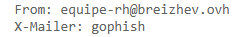
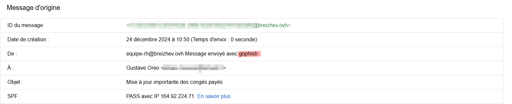
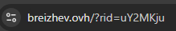
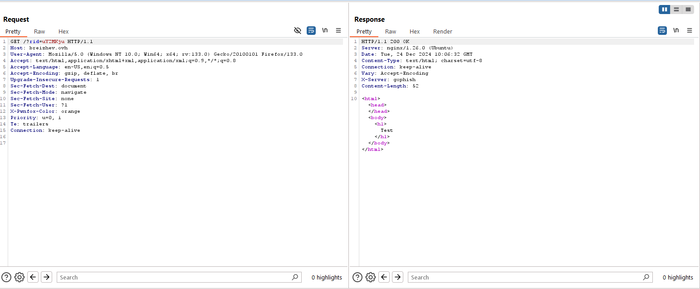
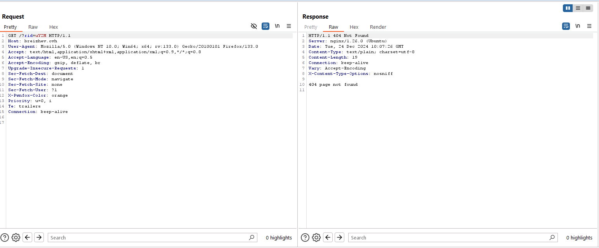
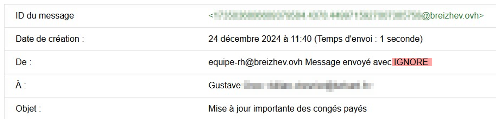
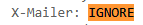
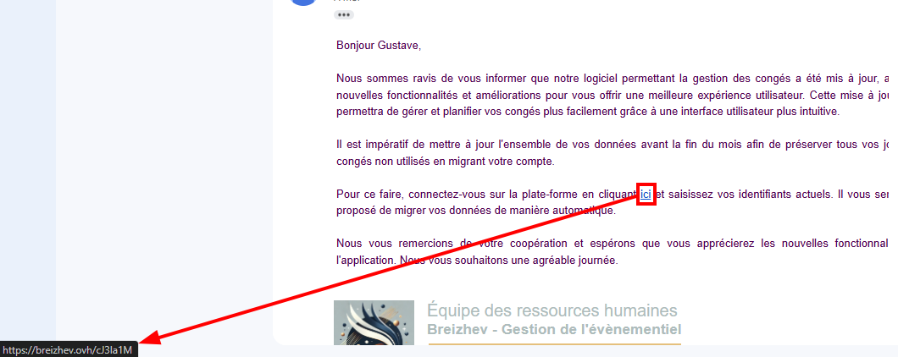
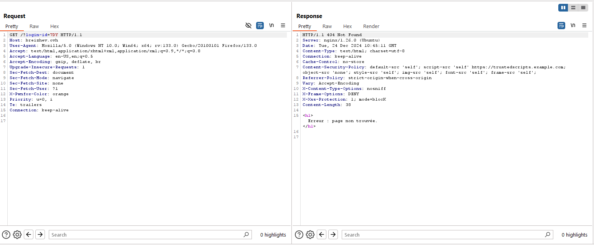
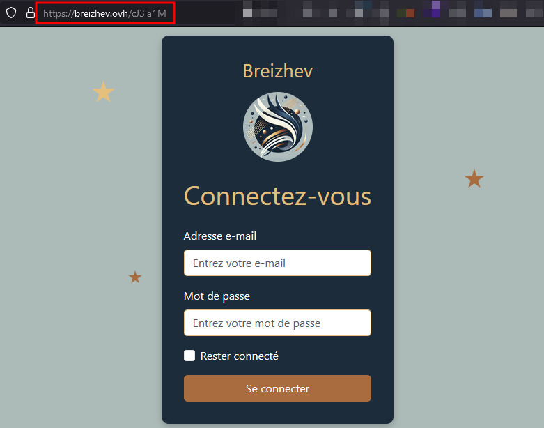

# Sneaky Gophish

## Comment rendre gophish moins détectable ?

### 0 - Introduction

Dans le monde numérique d'aujourd'hui, la sécurité informatique est plus cruciale que jamais. Les cybermenaces évoluent à une vitesse vertigineuse, et les entreprises doivent constamment adapter leurs défenses pour protéger leur système d'information. Parmi les nombreux outils disponibles pour tester et renforcer la sécurité, Gophish se distingue comme une plateforme de phishing open-source particulièrement efficace pour mener des campagnes de phishing. Cependant, pour des tests de pénétration vraiment réalistes, il est souvent nécessaire de rendre Gophish moins détectable, afin de contourner les systèmes de détection de plus en plus sophistiqués.

Cet article a pour objectif, à travers les différentes étapes et techniques nécessaires, de démontrer un cas de modification du code source de Gophish dans le but de le rendre moins détectable.

*Les exemples et illustrations de la modification du code de Gophish décrits ci-dessous sont strictements réservés à des fins légales et éthiques. Ils ne démontrent en aucun cas la rédaction d'un e-mail permettant le contournement des détecteurs de spam.* 

### 1 - Phishing

#### 1.1 - Définition

[Le phishing](https://fr.wikipedia.org/wiki/Hame%C3%A7onnage), ou hameçonnage, est une technique d'attaque par [ingénierie sociale](https://fr.wikipedia.org/wiki/Ing%C3%A9nierie_sociale_(s%C3%A9curit%C3%A9_de_l%27information)) utilisée par les pirates informatiques dont la finalité est d'obtenir des renseignements personnels afin de perpétrer une usurpation d'identité. En utilisant des biais cognitifs, cette technique permet de laisser sa victime penser qu'elle s'adresse à une personne ou une entité de confiance. Cela permet dans un cas de réussite de soutirer des informations (souvent sensibles) telles que des informations personnelles identifiantes (PII), nom d'utilisateur, mot de passe, coordonnées bancaires, etc. De manière générale, les attaques de phishing se réalisent au travers d'emails. Cependant, de nombreuses techniques d'ingénierie sociale, dérivée du phishing, ont émergé ces dernières années. Parmi elles il est possible de citer le Spear Phishing, le SMiShing, le Vishing, ou encore le Quishing.

#### 1.2 - Campagnes de phishing

Afin de sensibiliser ses collaborateurs et de réduire le risque de réussite d'un attaquant initiant une attaque de phishing, de plus en plus de sociétés mettent en place un exercice de campagne de phishing. Ce genre de manœuvre consiste à simuler une attaque de phishing, ciblée (Spear phishing) ou non. L'idée est d'atteindre le niveau le plus élevé de réalisme, sans pour autant causer de dégâts, le but étant d'améliorer le niveau de sensibilisation des sujets à ce genre d'attaque. Ainsi, divers moyens sont envisageables pour réaliser un tel exercice, notamment l'outil Open source mentionné dans les lignes précédentes : Gophish. 

### 2 - Gophish

#### 2.1 - Définition

[Gophish](https://getgophish.com/documentation/) est un kit de phishing Open source puissant, simple à utiliser, développé en [Golang](https://go.dev/). Il est principalement utilisé pour conduire des tests de phishing dont le but est d'être le plus réaliste possible. 

L'outil permet la configuration granulaire et la gestion de nombreux aspects de déroulement d'une campagne de phishing : gestion de modèles d'emails "frauduleux", de fausses pages de phishing, d'envoi automatique des mails, détection des événements et génération de statistiques.

L'idée de cette rubrique n'étant pas de réaliser un tutoriel sur l'utilisation de Gophish, ni d'en détailler toutes les notions, l'article suivant évoque les étapes clés pour réaliser une campagne de phishing basique avec Gophish : [Comment créer une campagne de phishing avec Gophish ?](https://www.it-connect.fr/comment-creer-une-campagne-de-phishing-avec-gophish/) *(source: it-connect, Florian Brunel)*

#### 2.2 - FUDNess

#### 2.2.1  - Pourquoi le rendre moins détectable ?

Bien que performant, Gophish n'est initialement pas conçu pour être l'outil le plus discret. En effet, les moyens de détection d'e-mails frauduleux évoluent rapidement et détectent alors très simplement les outils tels que Gophish.

Comme mentionné auparavant, l'objectif de la réalisation d'une campagne de phishing est bien évidemment d'évaluer le niveau de sensibilisation des collaborateurs, tout en étant **au plus proche de la réalité**. Cela signifie qu'avant d'initier l'envoi d'e-mails, il est nécessaire de s'assurer que ces derniers ne seront pas détectés par les anti-spams, au risque de mettre en péril l'exercice de phishing.

### 2.2.2 - Analyse d'un cas classique

Pour illustrer les différents exemples, le nom de domaine `breizhev.ovh` a été utilisé, représentant une **société purement fictive, tout comme le scénario**. Le sujet du mail était en rapport avec une fausse mise à jour d'un logiciel de congés, evnoyée par une équipe RH.

Après avoir envoyé un mail via Gophish, sans avoir effectué aucune modification du code au préalable, des détails qui pourraient alerter de l'utilisation de l'outil sont visibles à différents endroits :

- Dans les en-têtes de l'e-mail reçu (nom du serveur) :



- Dans le champ emetteur de l'e-mail (nom du serveur) :



- Au sein de l'URL de phishing (paramètre "rid" et forme des liens de phishing) :



- Via les en-têtes HTTP de la réponse du serveur (nom du serveur) :



- Ou encore dans les en-têtes HTTP de la réponse 404 :



Tous ces détails peuvent alerter de l'utilisation de Gophish et donc d'un potentiel e-mail frauduleux. Ainsi, ils doivent être modifiés / retirés afin d'éviter d'élever trop de soupçons.

### 3 - Rendre Gophish moins détectable

Le code analysé dans les sections qui suivent est basé sur la dernière version de Gophish, [la version v0.12.1 du 14 septembre 2022](https://github.com/gophish/gophish/releases/tag/v0.12.1).

Les grandes lignes de ces modifications sont inspirées de l'article suivant : [Never had a bad day phishing](https://www.sprocketsecurity.com/resources/never-had-a-bad-day-phishing-how-to-set-up-gophish-to-evade-security-controls)

#### 3.1 - Analyse et modification du code source au niveau du Web

#### 3.1.1 - Modification du paramètre "RID"

Pour s'organiser et distinguer chaque action en fonction d'une cible, Gophish inclut, au sein de ses URLs, un paramètre de "reconnaissance" nommé **rid**. L'utilisation de ce paramètre dont la valeur est aléatoire est nécessaire afin que Gophish traite chaque action effectuée vis-à-vis de la campagne de phishing.

Ainsi, il est extrêmement courant et finalement logique d'inclure ce paramètre au sein de règles de détection d'un potentiel e-mail frauduleux venant de l'outil. La première étape pour éviter une détection quasi-sûre d'un e-mail / lien envoyé par Gophish est donc la modification du nom de ce paramètre. 

En analysant le code source, il est rapide d'identifier que le nom du paramètre est défini au sein du fichier **campaign.go**, situé dans le dossier **models**, à la racine du projet. Les lignes sont les suivantes :

```go
129 // RecipientParameter is the URL parameter that points to the result ID for a recipient.
130 const RecipientParameter = "rid"
```

En modifiant la valeur de la constante **RecipientParameter**, ce premier problème de détection sera résolut.

#### 3.1.2 - 404 not found

L'un des autres moyens de détecter l'utilisation de Gophish se fait au travers de l'exposition de la page **404 Not found** par défaut. En effet, une URL Gophish ne contenant pas de paramètre clé valide pour identifier la correspondance avec un e-mail envoyé renvoie une erreur 404. Cette page d'erreur générique qui semble à première vue être une réponse classique peut s'avérer trompeuse et alerter quant à la légitimité de la page de phishing. Dans son [article](https://cybercx.co.nz/blog/identifying-gophish-servers/), Alain Homewood partage les détails permettant de détecter l'utilisation de Gophish au travers de la page d'erreur.

Dans un premier temps, il s'est révélé que Gophish retournait, dans le cadre d'une page non trouvée, des paramètres génériques tels que la longueur de la réponse du serveur de phishing, une combinaison d'en-têtes HTTP et / ou de la librairie Go HTTP, ou encore la réponse du serveur lors de la consultation du fichier robots.txt.

Il est alors nécessaire d'ajouter une [page d'erreur 404 personnalisée](https://edermi.github.io/post/2021/modding_gophish/). La partie de code pertinente va ainsi se situer au niveau du fichier **phish.go**, disponible dans le répertoire **controllers** à la racine du projet. En identifiant les nombreuses utilisations de la fonction *http.NotFound()* native de la librairie Go HTTP, il va être possible de modifier le code source et d'y ajouter les deux fonctions suivantes :

```go
//Add custom error with custom HTTP Headers
func customError(w http.ResponseWriter, error string, code int) {
	w.Header().Set("Content-Type", "text/html; charset=utf-8")
	w.Header().Set("Content-Security-Policy", "default-src 'self'; script-src 'self' https://trustedscripts.example.com; object-src    		    			  'none'; style-src 'self'; img-src 'self'; font-src 'self'; frame-src 'self';")
	w.Header().Set("X-Content-Type-Options", "nosniff")
	w.Header().Set("X-Frame-Options", "DENY")
	w.Header().Set("X-XSS-Protection", "1; mode=blocK")
	w.Header().Set("Cache-Control", "no-store")
	w.Header().Set("Referrer-Policy", "strict-origin-when-cross-origin")
	w.WriteHeader(code)
	fmt.Fprintln(w, error)
}

//Customize 404 not found error by using an HTML template
func customNotFound(w http.ResponseWriter, r *http.Request) {
	tmpl404, err := template.ParseFiles("templates/404.html")
	if err != nil {
		log.Fatal(err)
	}
	var b bytes.Buffer
	err = tmpl404.Execute(&b, "")
	if err != nil {
		http.NotFound(w, r)
		return
	}
	customError(w, b.String(), http.StatusNotFound)
}
```

L'idée derrière est d'utiliser une fonction dédiée, écrite au sein du fichier **phish.go** à la place de la fonction native Go *[http.NotFound](https://pkg.go.dev/net/http)*, initialement utilisée, qui peut révéler des indicateurs sur l'utilisation de Gophish.

En remplaçant toutes les occurrences de `http.NotFound`dans le fichier concerné par la fonction précédemment ajoutée, `customNotFound`, Gophish utilisera désormais un fichier HTML en guise de réponse, avec un contenu personnalisé :

```bash
sed -i 's/http.NotFound/customNotFound/g' controllers/phish.go
```

#### 3.1.3 - Modification de l'aspect du lien de phishing

Par défaut, Gophish propose un lien de phishing de la forme suivante : ` http://example.com?rid=<RID>`. Cependant, la présence d'un identifiant aléatoire à la suite d'un paramètre pourrait potentiellement avertir un utilisateur. Ainsi, Gophish proposant différentes variables qui peuvent être positionnées grâce à des [modèles de référence](https://docs.getgophish.com/user-guide/template-reference), une autre modification possible est la modification de l'URL de phishing. 

Dans cet exemple, l'identifiant unique sera placé après le nom de domaine, mais il pourrait très bien être placé n'importe où. La ligne suivante permet ainsi, au sein d'un modèle d'e-mail au format HTML, d'inclure un lien ayant la forme `http://example.com/<RID>` :

``````html
<a href="https://breizhev.ovh/{{.RId}}">ici</a>
``````

Cette modification requiert ainsi des modifications du côté du serveur de phishing. Pour cette démonstration, le serveur Web [nginx](https://nginx.org/en/) a été utilisé avec la configuration suivante pour un site par défaut :

```nginx
server {
    listen    443 ssl;
    ssl_certificate     /etc/letsencrypt/live/breizhev.ovh/fullchain.pem;
    ssl_certificate_key  /etc/letsencrypt/live/breizhev.ovh/privkey.pem;
    server_name    breizhev.ovh;

    location /track {
        include proxy_params;
        proxy_pass http://127.0.0.1:2222;
    }

    location /ressources/ {
        root /var/www/;
    }

    location / {
	   # Règle permettant la réécriture des URL de la forme https://*/<ID> vers https://*?login-id=<ID>
        rewrite ^/(.*)$ /?login-id=$1 break;
        proxy_pass http://127.0.0.1:2222;  
        proxy_set_header Host $host;
        proxy_set_header X-Real-IP $remote_addr;
        proxy_set_header X-Forwarded-For $proxy_add_x_forwarded_for;
        proxy_set_header X-Forwarded-Proto $scheme;
    }
}
```

Ainsi, en réécrivant les URL au travers de cette configuration et en les envoyant au serveur de phishing, Gophish peut désormais traiter des liens avec un aspect personnalisé. 

#### 3.2 - Analyse et modification du code source au niveau des mails

#### 3.2.1 En-têtes d'e-mail et HTTP

Par défaut, Gophish utilise des en-têtes qui alertent de l'utilisation de l'outil et font sonner les détecteurs d'e-mails frauduleux :

**X-Gophish-Contact** et **X-Gophish-Signature**.

X-Gophish-Signature est utilisé dans le cadre des [Webhooks](https://docs.getgophish.com/user-guide/documentation/webhooks) et peut rapidement se faire détecter, tandis que X-Gophish-Contact est utilisé à des fins de transparence.

À l'aide de la commande *grep*, utilisée à la racine du projet, il est rapide d'identifier la présence de ces deux en-têtes alertant dans les parties de code suivantes : 

```go
/* grep -r "X-Gophish" . */

/* ./models/email_request.go */
122 if conf.ContactAddress != "" {
123 	msg.SetHeader("X-Gophish-Contact", conf.ContactAddress)
124 }

/* ./models/email_request_test.go */
80 expectedHeaders := map[string]string{
81 	  "X-Mailer":          config.ServerName,
82	  "X-Gophish-Contact": s.config.ContactAddress,
83 }

/* ./models/maillog.go */
201 if conf.ContactAddress != "" {
202 	msg.SetHeader("X-Gophish-Contact", conf.ContactAddress)
203 }

/* ./models/maillog_test.go */
268 expectedHeaders := map[string]string{
269		"X-Mailer":          config.ServerName,
270	  	"X-Gophish-Contact": s.config.ContactAddress,
271 }

280 expectedHeaders := map[string]string{
281		"X-Mailer":          "",
282		"X-Gophish-Contact": "",
283 }

/* ./webhook/webhook.go */
289 Headers: []Header{
290		Header{Key: "X-Gophish-Contact", Value: ""},
291		Header{Key: "X-Mailer", Value: ""},
292 },
```

Tous ces en-têtes peuvent être remplacés par des en-têtes plus génériques, tels que **X-Original-From** et **X-Signature**, à l'aide des deux commandes suivantes :

```go
/* Pour chaque fichier, remplacer X-Gophish-Contact par X-Original-From */
sed -i 's/X-Gophish-Contact/X-Original-From/g' models/email_request_test.go
sed -i 's/X-Gophish-Contact/X-Original-From/g' models/maillog.go
sed -i 's/X-Gophish-Contact/X-Original-From/g' models/maillog_test.go
sed -i 's/X-Gophish-Contact/X-Original-From/g' models/email_request.go

/* Pour chaque fichier, remplacer X-Gophish-Signature par X-Signature */
sed -i 's/X-Gophish-Signature/X-Signature/g' webhook/webhook.go
```

#### 3.2.2 - Server name

Pour éviter de se faire détecter par le nom de serveur affiché au sein des en-têtes d'un e-mail, l'une des manipulations au niveau du code source à réaliser est la modification de la constante **ServerName** au sein du fichier **config.go**, présente dans le dossier **config** :

```go
45 // ServerName is the server type that is returned in the transparency response.
46 const ServerName = "gophish"
```

Aisni, en remplaçant la valeur `gophish` par  `IGNORE` afin d'éviter tout risque d'usurpation d'un client ou d'un serveur de messagerie, le risque de détection sera moins elevé. L'article suivant détaille ce propos : [SMTP Forwarders / Relays](https://www.ired.team/offensive-security/red-team-infrastructure/smtp).

Une fois toutes ces modifications réalisées, il suffira de construire le projet et d'exécuter le binaire `gophish` :

```go
go build
```

#### 3.3 Constatation des changements

Après avoir initié une campagne de phishing en reprenant le même scénario qu'auparavant, des changements ont pu être constatés.

Dans un premier temps, les en-têtes et champs inclus dans les e-mails envoyés ne contenaient plus le terme `Gophish` :





Le lien contenu dans le mail était quant à lui, sous une forme différente de celle proposée initialement par Gophish :



De même, le paramètre `rid`, assez commun au sein des environnements Gophish était changé :


Enfin, les en-têtes HTTP ajoutés ainsi que la page d'erreur `404` étaient correctement modifiés :



En ce qui concerne la réécriture des liens, la page de phishing pouvait être consultée suite à la configuration du serveur nginx, avec le lien renseigné dans le mail :



### 4 - Résumé

Pour résumer, le code source Gophish s'est vu attribué quatre principaux changements, la réécriture des liens étant réalisée par nginx :

- Changement du paramètre `rid` : ce paramètre a été changé pour éviter de se faire détecter lors de la visite d'une page de phishing
- Ajout d'en-têtes HTTP personnalisés et d'une page d'erreur 404 
- Changement du nom du serveur, affiché dans certains champs des e-mails envoyés et en-têtes HTTP
- Modification des en-têtes X-Gophish

### 5 - Références

- Configuration d'un Gophish FUD : https://www.sprocketsecurity.com/resources/never-had-a-bad-day-phishing-how-to-set-up-gophish-to-evade-security-controls
- Utilisation de base de Gophish https://www.it-connect.fr/comment-creer-une-campagne-de-phishing-avec-gophish/
- Documentation de Gophish https://getgophish.com/documentation/
- Testeur de mails : https://www.mail-tester.com/
- Détection des serveurs Gophish : https://cybercx.co.nz/blog/identifying-gophish-servers/
- Customisation de la page 404 not found : https://edermi.github.io/post/2021/modding_gophish/
- Repository Github : https://github.com/gophish/gophish